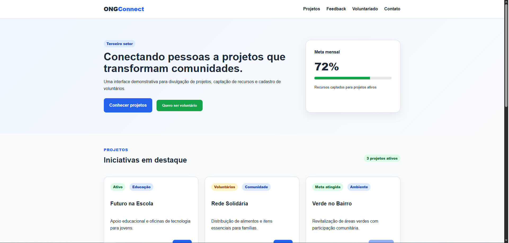

#  ONG Connect

Plataforma web responsiva desenvolvida para simular um ambiente digital voltado a organizações do terceiro setor, permitindo apresentar projetos, incentivar o voluntariado e demonstrar diferentes formas de interação com o usuário.

🔗 **Demonstração online:**  
https://leonardocarrara-cloud.github.io/ong-connect/

## 🖥️ Preview


##  Sobre o projeto

O ONG Connect foi desenvolvido inicialmente como um projeto acadêmico da graduação em Análise e Desenvolvimento de Sistemas, com foco na aplicação prática de conceitos modernos de desenvolvimento Front-end.

O projeto utiliza HTML5, CSS3 e JavaScript para construir uma interface responsiva, organizada e acessível, adaptando-se a diferentes tamanhos de tela.

Além dos requisitos acadêmicos, o projeto foi publicado no GitHub Pages como parte do meu portfólio de desenvolvimento.

##  Funcionalidades

- Interface responsiva para desktop, tablet e dispositivos móveis
- Menu de navegação responsivo com versão hambúrguer
- Cards para apresentação de projetos sociais
- Área de voluntariado com formulário
- Validação visual dos campos do formulário
- Modal interativo
- Notificações do tipo Toast
- Alertas de sucesso, atenção e erro
- Badges para categorização de informações
- Estados visuais de botões (`hover`, `focus`, `active` e `disabled`)

##  Tecnologias utilizadas

- **HTML5** — estrutura semântica da aplicação
- **CSS3** — estilização e responsividade
- **JavaScript** — interações e comportamento dos componentes
- **GitHub Pages** — publicação da aplicação

##  Conceitos aplicados

O projeto utiliza um Design System baseado em variáveis CSS para manter consistência entre cores, tipografia e espaçamentos.

Também foram aplicados:

- CSS Grid com sistema de 12 colunas
- Flexbox
- Media Queries
- Breakpoints responsivos
- Variáveis CSS (`:root`)
- Pseudo-classes CSS
- Hierarquia tipográfica
- Feedback visual de formulários
- Componentes reutilizáveis de interface
- Princípios básicos de acessibilidade

##  Responsividade

A interface utiliza diferentes breakpoints para adaptar a distribuição dos componentes conforme a largura da tela.

Em dispositivos móveis, elementos são reorganizados verticalmente e o menu tradicional é substituído por um menu hambúrguer. Em tablets e desktops, o Grid permite aproveitar melhor o espaço horizontal disponível.

##  Estrutura do projeto

```text
ong-connect/
├── index.html
├── style.css
├── script.js
└── README.md
```

##  Executando localmente

Não é necessário instalar dependências.

1. Faça o download ou clone o repositório.
2. Abra o arquivo `index.html` em um navegador moderno.

##  Contexto

Projeto desenvolvido durante a graduação em **Análise e Desenvolvimento de Sistemas (ADS)** com o objetivo de praticar desenvolvimento Front-end e consolidar conhecimentos de HTML, CSS, responsividade e interatividade com JavaScript.

---

Desenvolvido por **Leonardo Carrara**.
